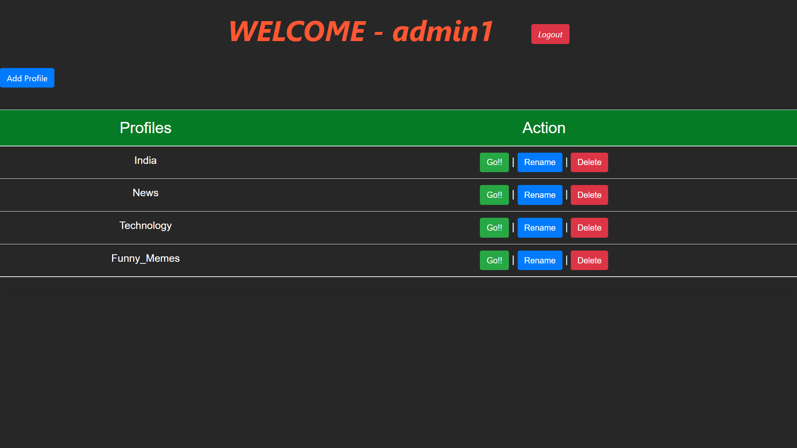
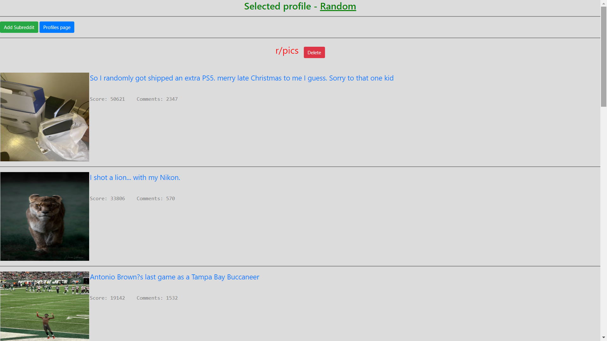
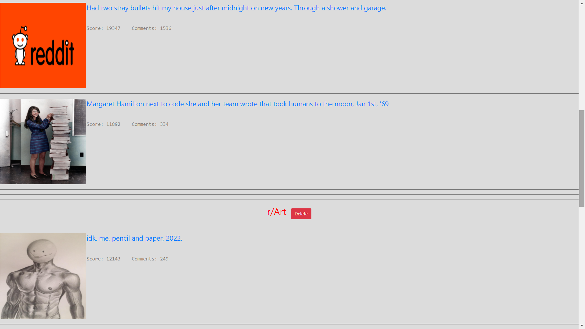

<!-- PROJECT LOGO -->
<br />
<div align="center">
<h3 align="center">Reddit Reader</h3>

  <p align="center">
    A convenient app 
</div>


<!-- TABLE OF CONTENTS -->
<details>
  <summary>Table of Contents</summary>
  <ol>
    <li>
      <a href="#about-the-project">About The Project</a>
      <ul>
        <li><a href="#built-with">Built With</a></li>
      </ul>
    </li>
    <li>
      <a href="#getting-started">Getting Started</a>
      <ul>
        <li><a href="#prerequisites">Prerequisites</a></li>
        <li><a href="#installation">Installation</a></li>
      </ul>
    </li>
    <li><a href="#usage">Usage</a></li>
    <li><a href="#contact">Contact</a></li>
  </ol>
</details>


<!-- ABOUT THE PROJECT -->
## About The Project

Reddit Reader is an app for easy access of reddit posts in a single page. It grabs top 5 posts from each of the selected subreddits and puts them on a single page (based on your custom profile). 
It's a custom reader which allows you to create your own account and have multiple custom profiles in it. Add as many subreddits to these custom profiles and the app will display top 5 posts from each subreddit.

<p align="right">(<a href="#top">back to top</a>)</p>


### Built With

* [Spring](https://spring.io/)
* [Hibernate](https://expressjs.com/)
* [Tomcat](https://tomcat.apache.org/)
* [MySQL](https://www.mysql.com/)
* [Jackson API](https://github.com/FasterXML/jackson)
* [Bootstrap](https://getbootstrap.com)

<p align="right">(<a href="#top">back to top</a>)</p>


<!-- GETTING STARTED -->
## Getting Started

Clone this project via - ```https://github.com/Devanshu1999/Reddit_Reader.git``` OR simply download as a zip and extract.

### Prerequisites

This app requires MySQL Workbench to be installed on the machine (Preferrably v8.0). Also install tomcat server.

For the connection, I have used "root" as username and "toor" ass password.

*These can be modified from the "persistence-mysql.properties" file present in the resource directory.*

To set up the table, there are two ways:-

    METHOD-1:
    -Use the "reddit_reader_dump.sql" dump file to make database and tables. This will fill some sample rows in the tables.

    METHOD-2:
    -Run the "sql_script.sql" script file. This will create empty tables. 

### Installation

1. Import this project as a Maven project and use pom.xml to install all the dependencies.
2. Configure the project to use tomcat server. Refer [docs](https://tomcat.apache.org/tomcat-9.0-doc/index.html)
3. Change jdbc connection properties (if required) using "persistence-mysql.properties" file present in the resource directory.
<p align="right">(<a href="#top">back to top</a>)</p>

<!-- USAGE EXAMPLES -->
## Usage

<a href="https://github.com/Devanshu1999/Reddit_Reader">
    
</a>
<a href="https://github.com/Devanshu1999/Reddit_Reader">
    
</a>
<a href="https://github.com/Devanshu1999/Reddit_Reader">
    
</a>
<a href="https://github.com/Devanshu1999/Reddit_Reader">
    
</a>

<p align="right">(<a href="#top">back to top</a>)</p>


<!-- CONTACT -->
## Contact

Devanshu Verma - devanshuverma1234@gmail.com | [LinkedIn](linkedin.com/in/DevanshuVerma99)

<p align="right">(<a href="#top">back to top</a>)</p>
